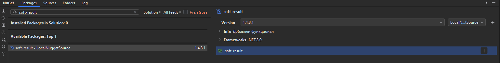

[https://www.nuget.org/packages/soft-result#readme-body-tab](https://www.nuget.org/packages/SoftResult)

---

# 🎯 **SoftResult**


## 📋 **Library Information**

- **Type:**          API Library  
- **Framework:**     .NET 8  
- **Dependencies:**  _None (lightweight library)_  

---

## ⚙️ **Purpose of the Library**  

SoftResult is a universal library for generating standardized API responses in ASP.NET Core. Its primary goals include:  
- 🔄 Wrapping API responses in `IResult`, derived from `IActionResult`.  
- 📦 Simplifying HTTP response handling in controllers, services, and Mediator.  
- 🔧 Providing a unified API response format for easier client and server interaction.  

---

## 🚀 **Setup Instructions**

1. 🛠️ Ensure that you have the **.NET 8** development environment installed.  
2. Run the following commands to build and publish the package:  

### **🔧 Build the Package**
```shell
dotnet build -c Release
```

### **📦 Create a Local Package Source**
```shell
mkdir /LocalNugget
```

### **📤 Publish the Package to a Local Source**
```shell
dotnet nuget push .\soft-result\bin\Release\soft-result.1.4.8.1.nupkg --source C:\LocalNugget\
```

### **🌐 Publish the Package to a Remote Source**
```shell
dotnet nuget push .\soft-result\bin\Release\soft-result.1.4.8.1.nupkg --api-key YOUR_API_KEY --source https://packages.salyk.kg/nuget
```

### **➕ Add a Local Source to NuGet**
```shell
dotnet nuget add source C:\LocalNugget\ --name LocalNuggetSource
```

### **🔍 View Local Sources**
```shell
dotnet nuget list source
```

### **📥 Add the Package to a Project**
```shell
dotnet add package soft-result --source LocalNuggetSource
```

---

## 🌟 **Key Use Cases**

1. **🔄 Universal API Responses:**  
   All API responses are wrapped in `IResult`, allowing for consistent processing of:  
   - 📝 Message (`Message`),  
   - 📦 Payload (`Value`),  
   - ❗ Errors (`Errors`),  
   - 📋 HTTP Status (`Status`).  

2. **📡 Working with HTTP Requests:**  
   Use the library for generating responses within system components, not just controllers.  

3. **⚙️ Controller Integration:**  
   Unified response mechanism through `IResult:IActionResult`.  

4. **📜 CQRS and MediatR:**  
   Simplify handling in commands and queries by returning `IResult`, making Mediator workflows more seamless.  

5. **🔧 Service Integration:**  
   Service methods return `IResult`, ensuring flexibility in status handling and error messaging.  

---

## 💻 **Example Usage**

### **📜 Query Returning `IResult`**
```csharp
using MediatR;
using WebApi.Application.Interfaces;
using WebApi.Domain.Entities.Dictionary;
using WebApi.SoftResult.Response;
using IResult = WebApi.SoftResult.Interfaces.IResult;

namespace WebApi.Application.Mediatr.Dictionary.SystemType.Queries;

public record GetSystemTypesQuery(
    bool? IsActive = true
) : IRequest<IResult>;

public class GetSystemTypesQueryHandler(
    IApplicationDbContext context
) : IRequestHandler<GetSystemTypesQuery, IResult>
{
    public async Task<IResult> Handle(GetSystemTypesQuery query, CancellationToken cancellationToken)
    {
        var result = context.SystemTypesDictionary.ToList();
        if (query.IsActive is not null)
        {
            result = result.Where(x => x.IsActive == query.IsActive).ToList();
        }

        return result.Any()
            ? Result<List<SystemTypesDictionaryEntity>>.Ok("✅ System list retrieved successfully", result)
            : Result<List<SystemTypesDictionaryEntity>>.NotFound("❌ No systems found");
    }
}
```

### **⚙️ Controller Method Returning `IActionResult`**
```csharp
[HttpGet("get-system-types")]
[Auth([Policies.ForAllPositions])]
public async Task<IActionResult> GetSystemTypes([FromQuery] GetSystemTypesQuery query, CancellationToken cancellationToken)
{
    var result = await Mediator.Send(query, cancellationToken);
    return result;
}
```

**💡 Note:**  
The controller can directly return the result from the `Query` since `IResult` inherits from `IActionResult`.  

---

## 📦 **Package Versioning**

- **soft-result: 1.4.8.1**  
  - **1:** Major version.  
  - **4:** Last digit of the year — 2024.  
  - **8:** .NET version.  
  - **1:** Incremental version (increased with each release).  

---

## 🎯 **Why Choose SoftResult?**

- 📋 **Consistent API Responses:** Simplifies client-side processing.  
- 🚀 **Easy Integration:** Works seamlessly with Mediator, controllers, and services.  
- 🔄 **Flexible:** Easily adapts to project-specific requirements.  
- 📜 **Standards Compliant:** Supports RFC 9457 for error descriptions.  

---

## 🌐 **NuGet Package**


---

Try **SoftResult** today to make your API standardized, simple, and efficient! 🎉
